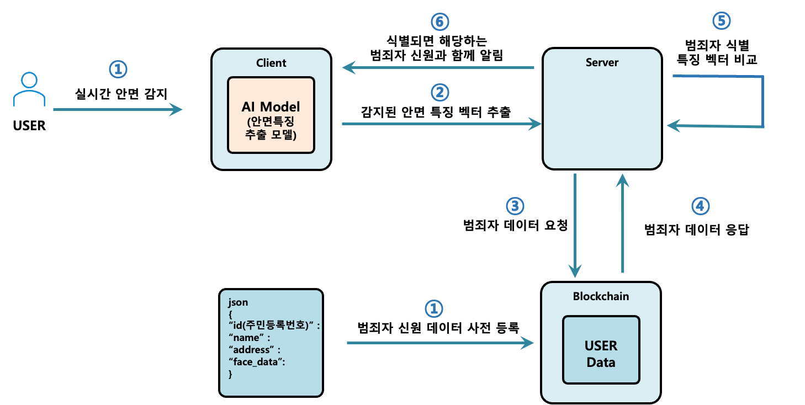
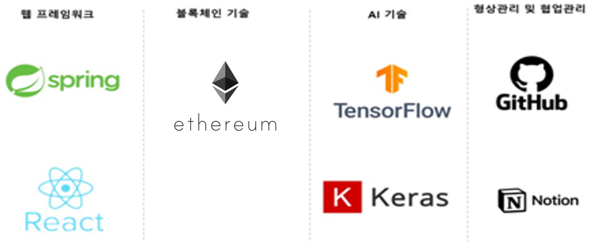

# AI 안면인식과 블록체인을 활용한 자동화 범죄자 추적 기술

# :books: 목차

- [:book: 프로젝트 소개](#book-프로젝트-소개)

  - [프로젝트 개요](#프로젝트-개요)
  - [프로젝트 요약](#프로젝트-요약)
  - [프로젝트 플로우차트](#프로젝트-플로우차트)
  <!-- - [DB 스키마](#db-스키마) -->

- [:wrench: 사용 기술 (Technique)](#wrench-사용-기술-technique)

  - [:hammer:기술 스택 (Technique Used)](#기술-스택-technique-used)

    - [**FrontEnd**](#frontend)
    - [**BackEnd**](#backend)
    - [**Smart Contract**](#smart-contract)
    <!-- - [**Deploy**](#deploy) -->

    <!-- - [Deploy :rocket:](#deploy-rocket) -->
    <!-- - [Connect](#connect) -->

- [:computer: 제공 기능 (Service)](#computer-제공-기능-service)

- [:SmartContract](#SmartContract)

- [:후기](#후기)

# :book: 프로젝트 소개

## 프로젝트 개요

국제 공조는 국제화에 따라서 초국가적 범죄, 범죄자의 해외 도피, 범죄 수익의 해외 유출이 급격하게 증가함에 따라 중요성이 강조되고 있다.

국제 공조에 있어서 기존 수사기관의 신상정보 공유 방식과는 다르게 자동화된 방식을 사용한 프로젝트이다.
블록체인 기술의 스마트 컨트랙트 코드와 안면 유사도 비교 알고리즘을 사용하여 실시간으로 안면 검출 및 인식을 통해 특징 벡터를 추출하고

블록체인에 사전에 등록해 놓은 범죄자 신원 데이터를 호출한다. 범죄자 데이터에서 얻은 범죄자 안면 특징 벡터와 추출한 특징 벡터를 유클리드 거리 계산을 통해 유사도를 비교하여
범죄자 일치여부를 확인하고 범죄 내역과 스마트 컨트랙트를 통해 적색수배 여부를 결정한다.

범죄자 신상정보의 투명성 및 무결성을 보장할 수 있으며 자동화 추적 기술을 통해 범죄 수사의 높은 효율을 기대할 수 있다.

## 프로젝트 요약

이 프로젝트는 블록체인과 안면 인식 기술을 이용하여 범죄자의 특징을 추출하고,사전에 등록된 데이터와 비교하여 범죄자를 확인하는 자동화된 시스템입니다.

이를 통해 범죄자 신상정보의 투명성과 무결성을 제고하며, 스마트 컨트랙트를 활용하여 적색수배 여부를 결정합니다.

## 프로젝트 플로우차트



# :wrench: 사용 기술 (Technique)



### FrontEnd

|                         Icon                         | Stack | Description     |
| :--------------------------------------------------: | :---: | --------------- |
|  | REACT | 프론트앤드 구성 |

### BackEnd

|                         Icon                          | Stack  | Description   |
| :---------------------------------------------------: | :----: | ------------- |
|  | SPRING | API 서버 제작 |

### Smart Contract

|                          Icon                           |  Stack   | Description          |
| :-----------------------------------------------------: | :------: | -------------------- |
|  | SOLIDITY | 스마트 컨트랙트 작성 |
|   | TRUFFLE  | 스마트 컨트랙트 배포 |
|  | ETHEREUM | 블록체인 네트워크    |
|   | GANACHE  | 로컬에서 테스트      |

<!-- ### Deploy

|                               Icon                                |        Stack        | Description                        |
| :---------------------------------------------------------------: | :-----------------: | ---------------------------------- |
|         |       DOCKER        | 컨테이너 생성, 배포 시 이미지 생성 |
|            |         EC2         | 배포 서버                          |
|        |      ROUTE 53       | DNS와 EC2서버 연결                 |
|            | CERTIFICATE MANAGER | SSL 인증서 생성                    |
|  |   GITHUB ACTIONS    | CI/CI 배포 자동화 사용             | -->

<!-- ## :construction:Architecture

## 1. FE .env 설정 -->

# :computer: 제공 기능 (Service)

## 홈화면

<div align="center" >
<!-- 홈화면 이미지 -->

</div>
범죄자의 신상정보를 입력한다. 사진 이름 국가 나이 범죄명 자산 등의 정보를 입력해야한다.

<div align="center">

</div>
transaction버튼을 클릭하면 transaction이 발생하며 안면 정보가 추출되고 입력정보에 따라서 적색수배 발령 여부가 결정된다.

<div align="center" >
<!-- 트랜잭션 이미지 -->


두 번의 트랜잭션이 발생한다.

범죄자의 정보를 기록하는 트랜잭션이 처음에 발생한 뒤적색수배 여부를 판다하는 트랜잭션이 진행되는 모습이다.

</div>

## 캠화면

<div align="center">

</div>
1.화면에 비친 사람의 얼굴이 실시간으로 블록체인에 기록된 범죄자의 안면정보와 비교된다.

<div align="center">

</div>
2.이때 유사도값이 0에 근접할수록 기록된 정보와 일치할 확률이 매우높아서 파란색 테두리가 아닌빨간색 테두리로 표시된다.

## SmartContract

```solidity
// 예시 솔리디티 코드
pragma solidity ^0.8.0;

function processRequest (
        string memory name,
        string memory nationality,
        uint256 age,
        string memory crime,
        uint256 amount,
        string memory discriptors
    ) public onlyAllowed returns (bytes32) {
        // 요청서 ID 생성
        bytes32 requestId = keccak256(
            abi.encodePacked(
                name,
                nationality,
                age,
                crime,
                amount,
                block.timestamp
            )
        );
        // 요청서 정보 저장
        Criminal memory newCriminal = Criminal(
            name,
            nationality,
            age,
            crime,
            amount,
            false,
            discriptors,
            0
        ); // token ID를 0으로 초기화
        criminals[requestId] = newCriminal;
        // 이벤트 발생
        emit RequestReceived(requestId, name, nationality, age, crime, amount);
        // 요청서 ID 반환
        return requestId;
    }


두번의 트랜잭션에서 첫번째로 발생하는 트랜잭션이다.
```

```solidity
// 예시 솔리디티 코드
pragma solidity ^0.8.0;

function calculateFleeingRisk(
string memory nationality,
uint256 age,
string memory crime,
uint256 amount
) internal pure returns (uint) {

        // 범죄 유형별 도피 가능성 계수
        uint256 crimeRiskFactor;
        if (keccak256(bytes(crime)) == keccak256(bytes("Money Laundering"))) {
            crimeRiskFactor = 5;
        } else if (keccak256(bytes(crime)) == keccak256(bytes("Fraud"))) {
            crimeRiskFactor = 10;
        } else if (
            keccak256(bytes(crime)) == keccak256(bytes("Drug Trafficking"))
        ) {
            crimeRiskFactor = 15;
        } else {
            crimeRiskFactor = 20;
        }


        // 전체 도피 가능성 계산
        uint256 totalRisk = nationalRiskFactor +
            ageRiskFactor +
            crimeRiskFactor +
            amountRiskFactor;
        return totalRisk;
    }


해외 도피가능성을 계산하는 함수의 일부이다. 범죄유형에 따라서 가중치를 다르게 부여한다.
```

```solidity
// 예시 솔리디티 코드
pragma solidity ^0.8.0;


function issueRedNotice(bytes32 requestId) public onlyAllowed{
// 요청서에 해당하는 범죄자 정보 가져오기
Criminal storage criminal = criminals[requestId];
// 요청서가 존재하고 적색수배가 아직 발령되지 않았다면
require(
criminal.age > 0 && !criminal.redNoticeIssued,
"Invalid request ID or red notice already issued"
);

        // 해외도피 가능성 계산
        uint256 fleeingRisk = calculateFleeingRisk(
            criminal.nationality,
            criminal.age,
            criminal.crime,
            criminal.amount
        );
        // 도피 가능성이 높으면 적색수배 발령
        require(
            fleeingRisk > 20,
            "Fleeing risk is too low to issue a red notice"
        );

         // 토큰 발행 및 정보 저장
        uint256 tokenId = _tokenIdCounter.current();
        _tokenIdCounter.increment();

        Criminal memory newCriminal = Criminal({
            name: criminal.name,
            nationality: criminal.nationality,
            age: criminal.age,
            crime: criminal.crime,
            amount: criminal.amount,
            redNoticeIssued: true,
            discriptors:criminal.discriptors,
            tokenId: tokenId
        }); // token ID를 0으로 초기화
        // criminals[requestId] = newCriminal;
        _criminalInfoList[tokenId] = newCriminal;
        // 토큰 생성
        _safeMint(msg.sender, tokenId);
        // 이벤트 발생
        emit RedNoticeIssued(requestId);

}


두번의 트랜잭션에서 마지막에 발생하는 적색수배 발령함수이다.

해외 도피가능성이 기준치를 넘으면 적색수배를 발령한다.

```

## 후기

### 문제해결
노트북의 웹캡을 통한 경량화된 api를 잘 찾아서 적용한 점
그리고 적색수배를 발령하는 수사기관이 복잡한 절차없이 스마트컨트랙트로 
자동화하고자 했다.


### 한계점

적색수배를 발령할때 판단하는 해외 도피가능성의 로직이 너무 단순했다.

의도했던 바는 수사기관에서 작성한 범죄자의 구체적인 정보와 적색수배를 발령하는 구체적인 양식에 의거해서 스마트 컨트랙트를 작성하고 싶었으나
적절한 알고리즘을 떠올리지 못하여 단순 범죄자의 정보를 기입하여 판단하는 로직으로 작성하였다.

기업의 스마트 컨트랙트의 적극적인 도입을 위해서는 신뢰성있는 자동화라는 측면에 맞아야 실현이 가능하다고 생각한다.

또한 팀원간의 소통이 부족하여 많은 시간을 허비해버렸던 점도 문제였다. 적극적인 소통과 프로젝트의 주제선정이

매우 중요함을 깨닫는 프로젝트였다.
